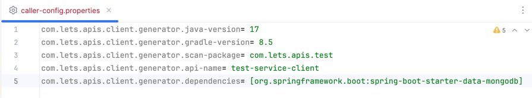

**FEIGN CLIENT API GENERATOR**

**lets-api-client-generator jar implementation**

    repositories {
        mavenCentral()
        maven {
            url = uri("https://maven.pkg.github.com/vuraltamer/lets-api-client-generator")
            credentials {
                username = project.findProperty("gpr.user") ?: System.getenv("GITHUB_USERNAME")
                password = project.findProperty("gpr.token") ?: System.getenv("GITHUB_TOKEN")
            }
        }
    }

    dependencies {
        implementation 'com.lets.apis.client.generator:lets-api-client-generator:1.0.0'
    }

**create caller-config.properties file for service class**

    com.lets.apis.client.generator.java-version= 17 //set your api version
    com.lets.apis.client.generator.gradle-version= 8.5 //set your api version
    com.lets.apis.client.generator.api-name= person-service-client
    com.lets.apis.client.generator.scan-package= com.project.main // must be last package before the subpackages (if not specified, it scans all classes from the base package)
    com.lets.apis.client.generator.dependencies= [org.springframework.boot:spring-boot-starter-data-mongodb,\
        \ sample:dependencies:1.0.0] // third party dependencies

caller-config path : src/main/resources/caller-config.properties

**generate feign client classes**

add this task to build.gradle

    tasks.register('createFeignClient', JavaExec) {
        mainClass = 'com.lets.apis.client.generator.ApiClientGenerator'
        classpath = sourceSets.main.runtimeClasspath
        args = []
    }

**run createFeignClient**

createFeignClient task is executed, a .generator file is created in the project root

**lets try**

- caller-config

- services

- run gradle createFeignClient command
 

- finally

