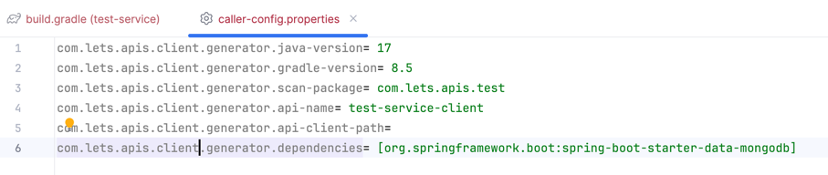
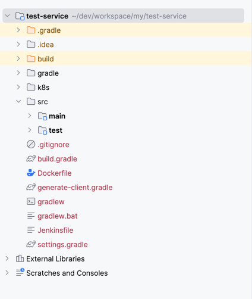
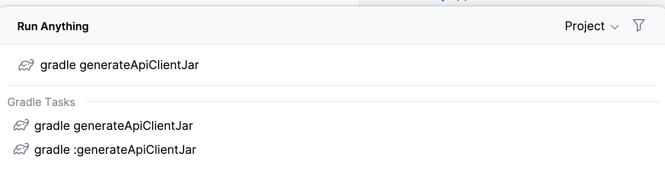
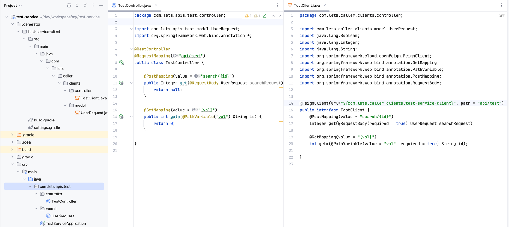

# 🚀 lets-api-client-generator

**Feign Client API Generator for Spring Boot Microservices**

`lets-api-client-generator` is a Gradle plugin that simplifies the generation of Feign Client classes from your Spring Boot service implementations. It scans your annotated service classes and automatically generates Feign-compatible clients, optionally packaged as a JAR file for reuse across multiple projects.

---

## 📦 Installation

Add the following to your project's `build.gradle`:

```groovy
repositories {
    mavenCentral()
    maven {
        url = uri("https://maven.pkg.github.com/vuraltamer/lets-api-client-generator")
        credentials {
            username = project.findProperty("gpr.user") ?: System.getenv("GITHUB_USERNAME")
            password = project.findProperty("gpr.token") ?: System.getenv("GITHUB_TOKEN")
        }
    }
}

dependencies {
    implementation 'com.lets.apis.client.generator:lets-api-client-generator:1.0.0'
}
```

Then apply the Gradle plugin:

```groovy
apply from: 'https://raw.githubusercontent.com/vuraltamer/lets-api-client-generator/refs/heads/master/doc/generate-client.gradle'
```

> Alternatively, you can download the file and apply it locally:

```groovy
apply from: 'generate-client.gradle'
```

## ⚙️ Configuration

To customize the generation, create a file named `caller-config.properties` under:

```
src/main/resources/caller-config.properties
```

### Example: `caller-config.properties`

```properties
# Java version for the generated client (optional, default: 17)
com.lets.apis.client.generator.java-version=17

# Gradle wrapper version for generated build (optional, default: 8.5)
com.lets.apis.client.generator.gradle-version=8.5

# Name of the generated API client (required)
com.lets.apis.client.generator.api-name=person-service-client

# Output path for generated files (optional, default: current project directory)
com.lets.apis.client.generator.api-client-path=/temp

# Package to scan for service classes (optional, defaults to full scan)
com.lets.apis.client.generator.scan-package=com.project.main

# Third-party dependencies required during generation (optional but sometimes necessary)
com.lets.apis.client.generator.dependencies=[\
    org.springframework.boot:spring-boot-starter-data-mongodb,\
    sample:dependencies:1.0.0\
]
```

---

## 🛠️ Generate Feign Client

Once everything is configured, run the Gradle task:

```bash
./gradlew generateApiClientJar
```

This will:

- Scan service classes in the specified package
- Generate Feign-compatible client interfaces
- Package them into a JAR file (if configured)
- Output the files to the specified path

---

## 📸 Screenshots

### 1. Configuration file example



---

### 2. Sample service classes



---

### 3. Running the Gradle task

```bash
gradle generateApiClientJar
```



---

### 4. Generated client output



---

## 🔍 Example Project


## 📦 Bean definition for client jar usage

```groovy
    implementation 'org.springframework.cloud:spring-cloud-starter-openfeign'
    implementation 'io.github.openfeign:feign-okhttp' // For patchMapping usage
    implementation 'generated-fein-client'
```

```java

    @EnableFeignClients // For your configuration
    
    @Bean // For patchMapping usage
    public Client feignClient() {
        return new OkHttpClient(new okhttp3.OkHttpClient());
    }

    @Bean // For Multipart file usage
    public Encoder feignFormEncoder() {
        return new SpringFormEncoder(new SpringEncoder(messageConverters()));
    }

    @Bean("feignHttpMessageConverters")
    public ObjectFactory<HttpMessageConverters> messageConverters() {
        return () -> new HttpMessageConverters();
    }
```

---

You can try out the generator with the example project below:

👉 [Sample Repository – feign-client-generator-test](https://github.com/vuraltamer/feign-client-generator-test)

---

## 💡 Notes

- This tool is useful in microservice architectures where Feign clients are preferred for inter-service communication.
- Generated clients can be reused across modules or even published to internal Maven/Nexus repositories.
- Customize the behavior by editing the `caller-config.properties` file.

---

## 🧑‍💻 Contributing

Feel free to open issues or submit pull requests. Contributions are welcome!

---