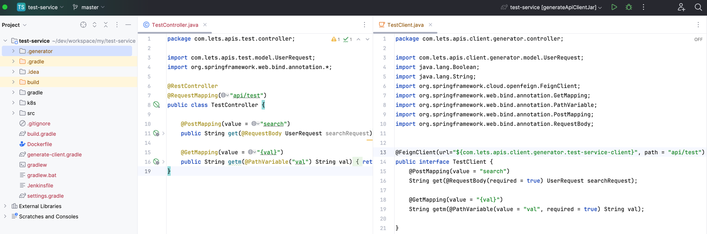

**FEIGN CLIENT API GENERATOR**

**lets-api-caller jar implementation**

    -run gradle jar command for lets-api-caller
    -lets-api-caller implementation for service class

**create caller-config.properties file for service class**

    com.lets.apis.api.caller.java-version= 17 //set your api version
    com.lets.apis.api.caller.gradle-version= 8.5 //set your api version
    com.lets.apis.api.caller.api-name= person-service-client
    com.lets.apis.api.caller.scan-package= com.project.main // must be last package before the subpackages (if not specified, it scans all classes from the base package)
    com.lets.apis.api.caller.dependencies= [org.springframework.boot:spring-boot-starter-data-mongodb,\
        \ sample:dependencies:1.0.0] // third party dependencies

caller-config path : src/main/resources/caller-config.properties

**generate feign client classes**

add this task to build.gradle

    task createFeignClient {
        doLast {
            def mainClass = 'com.lets.apis.api.caller.ApiCallerGenerator'
            def args = []
            javaexec {
                main = mainClass
                args = args
                classpath = sourceSets.main.runtimeClasspath
            }
        }
    }

**run createFeignClient**

createFeignClient task is executed, a .generator file is created in the project root

**service dependency requirements**

    dependencyManagement {
        imports {
            mavenBom "org.springframework.cloud:spring-cloud-dependencies:2021.0.8"
        }
    } // required

    dependencies {
        implementation 'org.springframework.boot:spring-boot-starter-web-services'
        implementation 'com.lets.apis:lets-api-caller:1.0.1' // api-caller jar
        implementation 'org.reflections:reflections:0.10.2' // required
        implementation 'org.springframework.cloud:spring-cloud-starter-openfeign' // required
        implementation 'org.projectlombok:lombok:1.18.24' // required
        annotationProcessor 'org.projectlombok:lombok:1.18.24' // required
        compileOnly 'org.projectlombok:lombok:1.18.28' // required
        testImplementation 'org.springframework.boot:spring-boot-starter-test'
        testRuntimeOnly 'org.junit.platform:junit-platform-launcher'
    }

**lets try**

- caller-config

- services

- run gradle createFeignClient command
 

- finally

